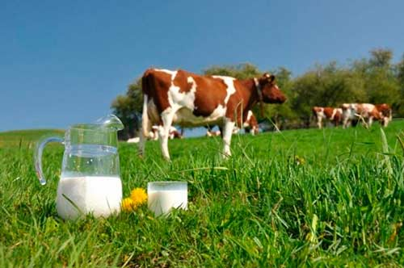
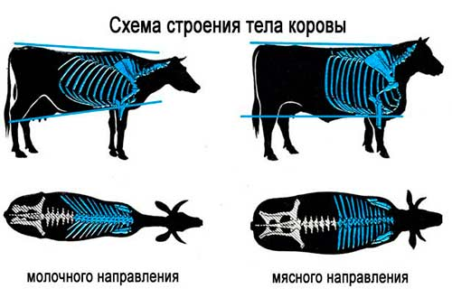

# Dairy breeds of cows. The productivity  of dairy cattle

#### Dairy products such as milk, yoghurt, cheese, butter, sour cream – are endless. These products occupy a huge value in the human diet, appear on our table thanks to the cattle. the Dairy cows is used not only for milk, but very often they are bred for meat production, despite the relatively small yield of meat from the carcass.

# Dairy breed of cattle. Features

#### Cattle dairy and meat cattle belong to a single species, but the differences between them are significant. Their productivity is due to different physiological features and characteristics of the exterior.

## Comparison of productivity of breeds of dairy

#### All breeds dairy cows have their advantages and, of course, not without drawbacks. For example, in Belarus it is recommended to grow local, well adapted varieties or crossbred animals. Purebred European breeds show good productivity in our climate. To decide what breed of cows make on your farmstead, you can take as a basis the following information:

| name of the breed of cattle | fat (%) | protein Content (%) | Average annual milk yield (MT) |
| --------------- | --------------- | --------------- | --------------- |
| Ayrshire | 4,28 | 3,44 | 8,57 |
| Dutch | 3,5~4 | 3~3,5 | 4,5 |
| Jersey | 5~6| 4 | 3,0~3,5 |
| Red steppe | 3,5~4,0 | 3.7 V~3,9 | 3,2~3,5 |